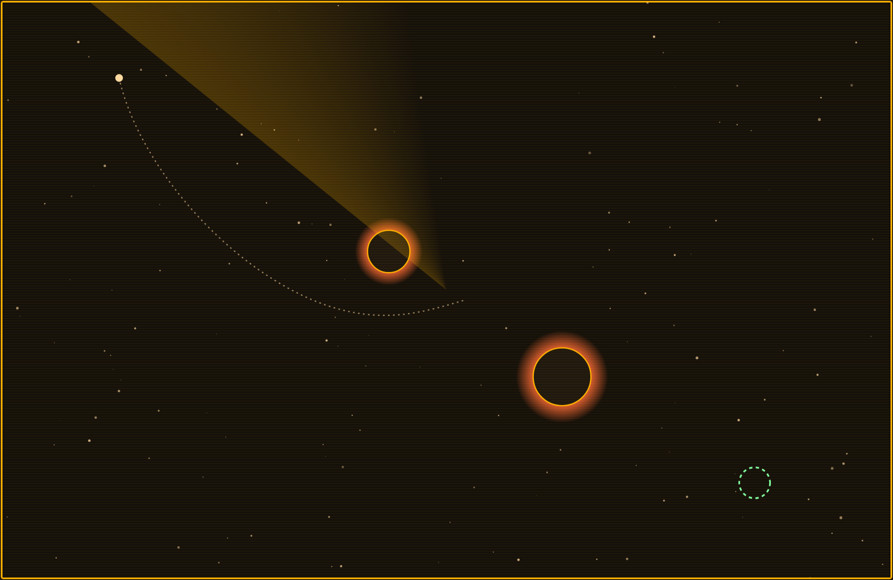

# Perigee

**▶ Live demo — [apps.charliekrug.com/perigee](https://apps.charliekrug.com/perigee/)**

[](https://github.com/ctkrug/perigee/actions/workflows/ci.yml)
[](LICENSE)

Aim once. Real gravity does the rest.

Perigee is a daily gravity-slingshot puzzle. Each day gives you one level: a probe, a
target, and a few planets in the dark between them. You draw a single aim vector and let
go, and a real n-body gravity simulation takes over and flies the probe. It curves toward
the planets, whips around them, and either threads the target in one clean arc or drifts off
into empty space. There is no thrust and no steering. The only thing you control is that
first aim, so the whole puzzle is reading the gravity before you commit.



## Who it's for

Daily-puzzle players who like reading a trajectory (the Angry Birds arc, the Kerbal Space
Program orbit) but don't want a physics sandbox with no goal or a campaign that eats an
evening. One sharp puzzle at lunch, not another app asking for an hour.

## What makes it different

- **The trajectory is computed, never scripted.** Every frame integrates the pull of every
  planet in the level with velocity-Verlet integration, so a slingshot behaves like an actual
  slingshot instead of a canned animation.
- **You see the physics before you commit.** While you aim, a dashed ghost path runs the same
  simulation forward, so a good shot is a read rather than a blind guess.
- **One level a day, keyed to the date.** Everyone solves the same puzzle and compares the
  same par. Five hand-designed levels rotate and repeat, each built around a distinct
  gravity-assist idea: a slingshot, a wraparound, a threading pass, a near-capture, and a
  twin-well balance.
- **Par and a no-spoiler share.** Reaching the goal shows your shot count against par and a
  share string carrying only the date and count, never the solution.
- **One gesture, keyboard included.** Drag to aim and release to launch, or aim with the arrow
  keys and fire with Enter or Space. The challenge is reading gravity, never execution.
- **Game feel with no binary assets.** Impact shake and flash, a goal-ring pulse, a fading
  motion trail, a win particle burst, and WebAudio-synthesized sound with a persisted mute,
  all honoring `prefers-reduced-motion`.

## How to play

1. Drag out from the probe to set your aim. The dashed ghost path previews the flight.
2. Release to launch, then watch the probe fly under real gravity.
3. Thread the target under par. Miss and the probe resets for another aim.

Keyboard: arrow keys rotate and power the aim, Enter or Space launches, Escape cancels.

## Run it locally

```sh
npm install
npm run dev      # local dev server
npm test         # unit tests (physics core + pure game logic)
npm run lint     # lint src/ and test/
npm run build    # production build to site/
```

The build in `site/` uses relative asset paths only, so it serves correctly from any
subpath (for example `apps.charliekrug.com/perigee`) with no server.

## How it works

- **`src/core/`** is the pure physics: `{x, y}` vector math, a velocity-Verlet `step()`
  integrator with a softened gravity well, a `predict()` trajectory used for the ghost path,
  and `resolveShotOutcome()`, the goal-then-crash-then-bounds rule that decides how every shot
  ends. It has no DOM dependency and is fully unit tested.
- **`src/game/`** wires that core to the browser: canvas rendering, pointer and keyboard input,
  synthesized audio, the daily level rotation, the HUD, and the win overlay.

See [`docs/ARCHITECTURE.md`](docs/ARCHITECTURE.md) for the full code map,
[`docs/VISION.md`](docs/VISION.md) for the design rationale, and
[`docs/DESIGN.md`](docs/DESIGN.md) for the visual direction.

## License

MIT. See [LICENSE](LICENSE).

---

More of Charlie's projects → https://apps.charliekrug.com
